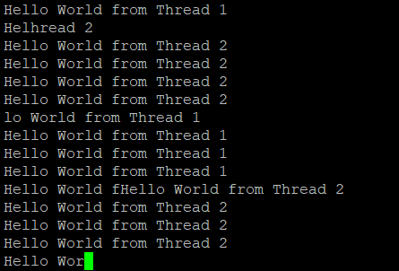

- [No Semaphore](#no-semaphore)
- [Spinlock Semaphore](#spinlock-semaphore)
- [Cooperative Semaphore](#cooperative-semaphore)

# No Semaphore

- Whenever a common resource is being shared i.e UART, SPI, I2C, LCD, CAN interfaces etc simultaneous access can cause a lot of problems.

- In this example we are writing data to the UART from thread 1 and thread 2
- As you can see in the image above when writing to the UART Task1/Task2 might be pre-empted before the entire data can be written to the UART
- The above problem of shared resources can be solved using Semaphores
- Semaphores are essentially signals that can signal certain parts of the code when something is done/needs to be done.

# Spinlock Semaphore

- Wait for a signal to be raised to gain access to a shared resource
- During a **wait** this shared resource burns CPU cycles till it gets a signal from another thread.

- In this example since UART is a common resource between the thread1 and thread2 we use a form of communication between the two threads
- When the first thread has access to the UART the second thread is in the **wait** state (semaphore value is 0)
- Once the first thread is done writing data to the UART it gives a **signal** to the second thread.
- Conversely now the first thread is in the **wait** state. Once the second thread is done writing data to the UART it gives a **signal** to the first thread.

# Cooperative Semaphore

> TODO,
